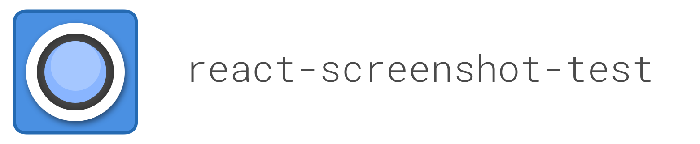
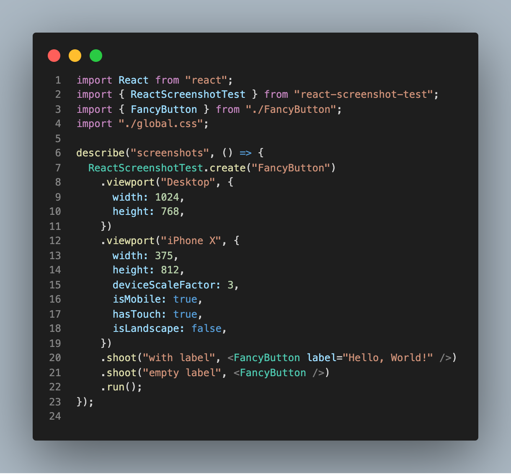
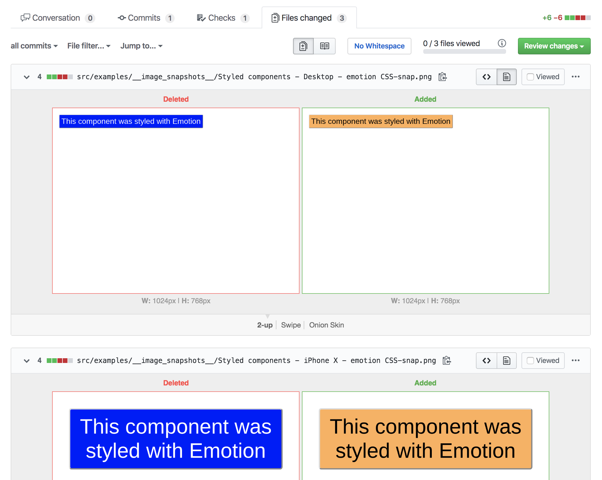

<h1 align="center">
🚀 For a better experience, try the newer <b><a href="https://github.com/zenclabs/viteshot">Viteshot 📸</a></b>
</h1>
<br/>
<br/>

[](https://www.npmjs.com/package/react-screenshot-test)

<p align="center">
  <a href="https://circleci.com/gh/fwouts/react-screenshot-test/tree/master">
    
  </a>
  <a href="https://www.npmjs.com/package/react-screenshot-test">
    
  </a>
  <a href="https://www.npmjs.com/package/react-screenshot-test">
    
  </a>
  <a href="https://www.npmjs.com/package/react-screenshot-test">
    
  </a>
</p>

<br />
<br />

Here is a screenshot test written with `react-screenshot-test`:

[](https://github.com/fwouts/react-screenshot-test/tree/master/example/FancyButton.screenshot.jsx)

All you need is to install `react-screenshot-test` and configure Jest:

```js
// jest.screenshot.config.js

module.exports = {
  testEnvironment: "node",
  globalSetup: "react-screenshot-test/global-setup",
  globalTeardown: "react-screenshot-test/global-teardown",
  testMatch: ["**/?(*.)+(screenshot).[jt]s?(x)"],
  transform: {
    "^.+\\.[t|j]sx?$": "babel-jest", // or ts-jest
    "^.+\\.module\\.css$": "react-screenshot-test/css-modules-transform",
    "^.+\\.css$": "react-screenshot-test/css-transform",
    "^.+\\.scss$": "react-screenshot-test/sass-transform",
    "^.+\\.(jpg|jpeg|png|gif|eot|otf|webp|svg|ttf|woff|woff2|mp4|webm|wav|mp3|m4a|aac|oga)$":
      "react-screenshot-test/asset-transform"
  },
  transformIgnorePatterns: ["node_modules/.+\\.js"]
};
```

You can then generate screenshots with `jest -c jest.screenshot.config.js -u`,
just like you would with Jest snapshots.

## What does it look like?

Here's a [real example](https://github.com/fwouts/react-screenshot-test/pull/18/files?short_path=9fa0253#diff-9fa0253d6c3a2b1cf8ec498eec18360e) of a pull request where a component was changed:
[](https://github.com/fwouts/react-screenshot-test/pull/18/files?short_path=c1101dd#diff-c1101ddb11729f8ee0750df5e9595b47)

## How does it work?

Under the hood, we start a local server which renders components server-side. Each component is given its own dedicated page (e.g. /render/my-component). Then we use Puppeteer to take a screenshot of that page.

Curious to learn more? Check out the [internal documentation](./docs/index.md)!

## Cross-platform consistency

If you work on a team where developers use a different OS (e.g. Mac OS and
Linux), or if you develop on Mac OS but use Linux for continuous integration,
you would quickly run into issues where screenshots are inconsistent across
platforms. This is, for better or worse, expected behaviour.

In order to work around this issue, `react-screenshot-test` will default to
running Puppeteer (i.e. Chrome) inside Docker to take screenshots of your
components. This ensures that generated screenshots are consistent regardless of
which platform you run your tests on.

You can override this behaviour by setting the `SCREENSHOT_MODE` environment
variable to `local`, which will always use a local browser instead of Docker.

_Note: On Linux, `react-screenshot-test` will run Docker using host network mode on port 3001_

## CSS support

CSS-in-JS libraries such as Emotion and Styled Components are supported.

| CSS technique                                          | Supported |
| ------------------------------------------------------ | --------- |
| `<div style={...}`                                     | ✅        |
| CSS stylesheets <br>`import "./style.css"`             | ✅        |
| Sass stylesheets<br>`import "./style.scss"`            | ✅        |
| CSS Modules<br>`import css from "./style.css"`         | ✅        |
| [Emotion](https://emotion.sh)                          | ✅        |
| [Styled Components](https://www.styled-components.com) | ✅        |

## Usage with create-react-app

If you'd like to set up `react-screenshot-test` with a `create-react-app`, [here is everything you need](https://github.com/fwouts/react-screenshot-test-with-create-react-app/compare/original...master).

## Storing image snapshots

We recommend using [Git LFS](https://git-lfs.github.com) to store image
snapshots. This will help prevent your Git repository from becoming bloated over time.

If you're unfamiliar with Git LFS, you can learn about it with [this short video (2 min)](https://www.youtube.com/watch?v=uLR1RNqJ1Mw) and/or going through [the official tutorial](https://github.com/git-lfs/git-lfs/wiki/Tutorial).

To set up Git LFS, [install the Git extension](https://git-lfs.github.com/) and add the following to `.gitattributes` in your repository ([source](https://github.com/americanexpress/jest-image-snapshot/issues/92#issuecomment-493582776)):

```
**/__screenshots__/*.* binary
**/__screenshots__/*.* filter=lfs diff=lfs merge=lfs -text
```

You may also need to set up Git LFS for continuous integration. See [our config](https://github.com/fwouts/react-screenshot-test/blob/master/.circleci/config.yml) for an example with CircleCI.

## Usage with Percy

If you prefer to keep image snapshots out of your repository, you can use a third-party service such as [Percy](https://percy.io):

- Install `@percy/puppeteer`
- Ensure that `PERCY_TOKEN` is set in your enviroment
- Set up a script to invoke Jest through Percy:

```json
{
  "screenshot-test-percy": "SCREENSHOT_MODE=percy percy exec -- jest -c jest.screenshot.config.js"
}
```

## TypeScript support

This library is written in TypeScript. All declarations are included.

## Browser support

At the moment, screenshots are only generated with Chrome. However, the design can be extended to any headless browser. File an issue if you'd like to help make this happen.

## Comparison

| Tool                                                                         | Visual | Open Source | Price for 100,000 snapshots/month | Jest integration | Review process                                                         |
| ---------------------------------------------------------------------------- | ------ | ----------- | --------------------------------- | ---------------- | ---------------------------------------------------------------------- |
| [react-screenshot-test](https://www.npmjs.com/package/react-screenshot-test) | ✅     | ✅          | Free                              | ✅               | Pull request                                                           |
| [Jest snapshots](https://jestjs.io/docs/en/snapshot-testing)                 | ❌     | ✅          | Free                              | ✅               | Pull request                                                           |
| [Percy](https://percy.io)                                                    | ✅     | ❌          | [\$469](https://percy.io/pricing) | ❌               | Separate UI                                                            |  |
| [storycap](https://github.com/reg-viz/storycap)                              | ✅     | ✅          | Free                              | ❌               | Implicit approval with [reg-suit](https://github.com/reg-viz/reg-suit) |

## Reporting issues

If something doesn't work, or if the documentation is unclear, please do not hesitate to [raise an issue](https://github.com/fwouts/react-screenshot-test/issues)!

If it doesn't work for you, it probably doesn't work for others either 🙃
